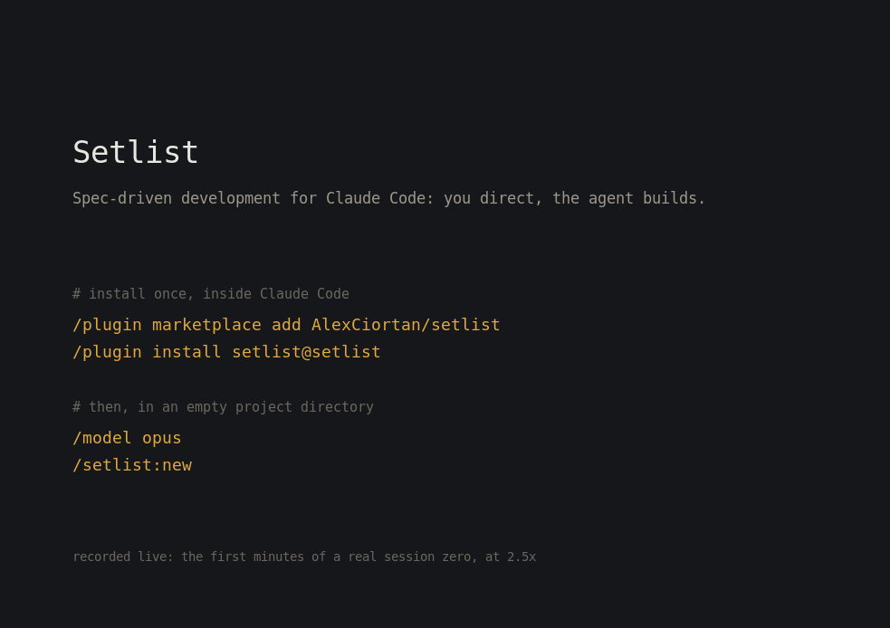

# Setlist

[](https://code.claude.com/docs/en/discover-plugins)
[](https://github.com/AlexCiortan/setlist/blob/main/.claude-plugin/plugin.json)
[](LICENSE)
[](https://github.com/AlexCiortan/setlist/actions/workflows/test.yml)

**Setlist** is spec-driven development for Claude Code: build real software by **directing rather than typing**. You act as architect and reviewer, the agent writes the code, and a spec (not the keyboard) is your control surface.



Setlist ships as an installable Claude Code plugin (`setlist`): seven slash commands (`new`, `retrofit`, `upgrade`, `checkpoint`, `validate`, `gate`, `journal`), four reference skills, and four mechanical hooks (three enforcement gates plus session re-grounding) stamped into every project it generates. The current edition of the framework document is **[setlist.md](setlist.md)** (edition v1.6; the version lives inside the file); you do not need to read it to start. The plugin version and the edition version are separate counters: the plugin counts releases of the tooling, the edition counts revisions of the document.

## Why Setlist

AI coding agents are powerful but drift: across a long project they lose context, wander from past decisions, and quietly expand scope. When you review instead of type, every ambiguity the agent resolves on its own ships unless you catch it later. Setlist's answer:

- **Specs are the contract.** Work proceeds one small spec at a time, each with exhaustive acceptance criteria.
- **Scope discipline is sacred.** An explicit, enforced out-of-scope list is the primary defense against ballooning.
- **Review is the gate, tests are the aid.** Your review is the quality bar; tests are written to be read as a specification of behavior.
- **Enforcement is mechanical, not aspirational.** Most agent methodologies are prompts that hold until the model forgets them. Setlist stamps four hooks into every project it generates: feature code cannot land on the trunk, commits are scanned for secrets and style violations before they exist, no spec merges without a complete closing report and a green test suite, and every session starts re-grounded from the repo. The rules survive long sessions, context compaction, and model swaps, because they do not live in the context window.
- **The repository is the memory.** Every durable decision lands in a version-controlled file: an ADR (architecture decision record) log with an index, a bounded status file, per-session journals, a living architecture diagram that is gate-checked at every merge. Any session, on any model, re-grounds by reading the repo. Chats are disposable; the repo persists.
- **Role separation is a native mechanism.** A *Planner* (thinks, decides, writes specs) and a *Builder* (writes code, runs tests, does Git), never blurred: the two map directly onto Claude Code's `opusplan` model setting, and the boundary is held by the same stamped hooks, not by hoping the agent remembers which hat it wears.
- **Every release is dogfooded cold.** No edition publishes without passing a real end-to-end gate ("Does it actually work?", below). The run artifacts drive the next edition; the framework is maintained under its own discipline.
- **Claude Code-native depth over multi-tool breadth.** Setlist binds the harness's real capabilities (plan mode, hooks, skills, session-start injection, plugin distribution) instead of targeting a lowest common denominator. When the harness grows a mechanism that replaces discipline, the framework absorbs it; that is how the hooks and the re-grounding injection came to exist.

## Quickstart

Requires Claude Code 2.1.193 or later (the marketplace rename migration and the `fallbackModel` chain both need it; the deny mechanic is verified on 2.1.200+). Install the plugin once, from inside Claude Code:

```
/plugin marketplace add AlexCiortan/setlist
/plugin install setlist@setlist
```

Then open Claude Code in your project directory, set the session to Opus, and run the entry command that fits:

```
/model opus
/setlist:new
```

Session zero runs on **Opus**, not `opusplan`: it is pure architecture work, and you want full reasoning strength for the whole conversation. Day-to-day building afterward is where `/model opusplan` takes over, and day-to-day Git runs through the shipped `/setlist:checkpoint` command.

## Get started, by situation

### Starting a new project: `/setlist:new`

Run it in an empty directory. What happens, in order:

1. **You describe the project** in plain conversation: what it is, your constraints (budget, solo or team, legal/privacy), and your working mode (*I write code too* or *I review only*; the second makes generated specs strict and exhaustive, because anything unspecified becomes an unreviewed guess).
2. **One structured interview round.** Only genuine forks become questions, recommendations come inline, and it opens with "what has changed since this edition was written" to catch tooling drift. It also live-verifies that the `opusplan` model binding actually resolves in your environment before committing it to settings.
3. **The foundational decisions, proposed for your approval before any file is written**: the stack (with explicit rejections), the core data model (the single highest-leverage decision), scope with an enforced out-of-scope list, and the riskiest assumption worth a throwaway spike. Each lands as an ADR, not as chat.
4. **Two-phase generation.** A mechanical stamp emits every framework-fixed file (the hooks, the config, the templates, the committed edition) with zero model tokens; the model then writes only what encodes your decisions: steering docs, founding ADRs, your first specs, and a `RUNBOOK.md` with your stack's concrete commands.
5. **Hand-off.** Nothing is committed yet by design: run `/scaffold` next. It is not a plugin command, which is why the table below does not list it: it is a project-local skill the bootstrap just generated into your repo. It wires the test harness, records your full-suite gate command, makes the first commit, and arms the enforcement hooks.

You end up with a tailored, enforced instance and a queue of real specs. From there, each feature follows the operating loop below.

### Adopting it on an existing codebase: `/setlist:retrofit`

Run it at the repo root. The whole session is planning plus documentation: it reads your code, it never edits it.

1. **Read-only inventory first.** It explores before asking anything: the actual stack, the de-facto core data model, state ownership, error handling as practiced, honest test-coverage reality, secrets exposure, and the riskiest areas. You see the report before a single question.
2. **The interview** adds one retrofit-specific fork: which existing constraints are **sacred** (not redesignable in the coming months) versus disposable, so no future spec proposes redesigning something you consider settled.
3. **Generation describes what IS, not what you wish.** Steering docs record every divergence between reality and intent with explicit callouts; the decision log is seeded with INFERRED entries read off the code, and confirming or superseding each one (the flip ceremony) is your first planning action afterward.
4. **The first spec is characterization tests** around the de-facto core: black-box assertions that pass against the unmodified codebase, so every later change has a regression net before it lands.
5. The whole retrofit lands as **one commit** on your default branch; the gates bind immediately using your repo's real test command.

### Already running an earlier edition: `/setlist:upgrade`

Run it at the root of a repo that carries an earlier `setlist.md` edition.

1. It confirms no spec is mid-build (or pauses one cleanly with a resume prompt), then **diffs your instance against the bundled edition**, using the edition's changelog as the authoritative delta list.
2. **One round of genuine forks** (accepted deviations to keep or retire); everything else gets a recommended default.
3. Execution happens on a **single migration branch**: relocations move verbatim under provenance banners (history is never rewritten), one umbrella ADR records the edition change, the committed edition file is replaced, and hook fixes arrive byte-for-byte.
4. It is a docs-only change by contract: **your gates must pass identically before and after**, and any difference is a finding, not noise.

### No plugin?

The plugin is the supported path, but the framework document is self-contained: copy [`setlist.md`](setlist.md) into your project, open a session on Opus, and ask it to run the protocol that fits: bootstrap, retrofit, or upgrade (the document carries all three). The protocols are identical; the plugin is a binding of the document, never the other way around.

### Try it in three prompts

The first two build on each other: prompt 2 assumes the project prompt 1 bootstrapped. Prompt 3 works on any repo, independently.

1. In an empty directory: `/setlist:new`, then answer its opening with *"A CLI reading tracker: log books and pages read, see streaks and a yearly pace. Solo project, I review only."* Watch it interview you and propose decisions before writing a single file. (The demo at the top of this page is this exact prompt.)
2. In a bootstrapped project with uncommitted changes: `/setlist:checkpoint` with *"survey and commit what is pending, spec-scoped."* It surveys the diff, checks for secrets and style violations, and commits with a spec-scoped message.
3. At the root of any existing repo: `/setlist:retrofit`. It shows you a read-only inventory report (stack, de-facto data model, test coverage reality) before asking a single question.

### Invocation discipline, built in

The stamping ceremonies (`/setlist:new`, `/setlist:retrofit`, `/setlist:upgrade`) are **user-only**: the model cannot decide on its own to bootstrap or migrate your repo. `/setlist:checkpoint` stays available to the model deliberately, so a session about to commit pulls the checkpoint checklist into context by itself. That split is the framework's philosophy in miniature: ceremonies with side effects wait for you; discipline loads itself.

## The full command and skill surface

The seven commands:

| Command | What it does | Invoked by |
|---------|--------------|------------|
| `/setlist:new` | Bootstraps a new project from an empty directory: interview, foundational decisions for your approval, then the tailored two-phase stamp. | You only |
| `/setlist:retrofit` | Audits an existing codebase read-only, interviews you, and retrofits the framework around what actually exists. | You only |
| `/setlist:upgrade` | Migrates an instance from an earlier edition to the bundled one, on a single docs-only chore branch, gates unchanged. | You only |
| `/setlist:gate` | Runs a stage-gate transition when your project moves between roadmap stages: verifies the stage's exit criteria leg by leg, reconciles the next stage's backlog, and specs its first entry. A failed gate is a finding, not a formality. (Distinct from the mechanical close gate that `/setlist:checkpoint` runs.) | You only |
| `/setlist:checkpoint` | Spec-scoped Git: opens the spec branch, surveys and commits with secret and style checks, runs the close gate, merges `--no-ff`. | You, or the model when about to commit |
| `/setlist:validate` | Idempotent health check of the instance: required files, bounded STATUS sections, hook wiring, config coherence. Reports findings, fixes nothing without approval. | You, or the model at a transition gate |
| `/setlist:journal` | Writes the numbered journal entry for a substantive session: raw notes, what surprised you, no narrative smoothing. | You, or the model after a substantive session |

One more lives outside the plugin: `/scaffold`, the project-local skill the bootstrap generates into your repo (it wires the test harness and makes the first commit; see step 5 above).

The plugin also carries four **reference skills**: context the model loads by itself at the moment it applies, never commands you type.

| Skill | Loads by itself when | What it carries |
|-------|----------------------|-----------------|
| `model-ladder` | A session weighs escalating models | The escalation rules between planning and execution tiers |
| `planner-discipline` | Planning work starts | The operating loop, the read budget, and the park-do-not-improvise rule |
| `spec-authoring` | A spec is being written | The spec template and the closing-report contract |
| `design-surface` | UI work routes through a design intake | Locked redlines as spec contracts, design QA on the branch |

Each skill also carries a **Gotchas** section grown from real field failures, never speculation. This table is the complete surface: the publish tooling mechanically refuses a release whose README and shipped skills disagree, in either direction.

## Why one spec at a time

The first question anyone arriving from a multi-agent harness asks is what Setlist does about parallelism. The honest answer is that the sequential model is a deliberate position, not a missing feature.

One spec is active at a time, and no two agents write coupled code at once. The bet is that for a person directing rather than typing, correctness of decisions beats throughput of execution: the bottleneck in agent-assisted work is not how fast code appears, it is how much of it you can actually review before it becomes the foundation for the next thing. Ten features arriving in parallel is not ten times the progress if you can only genuinely review two of them. Read-only parallelism is unrestricted, because that constraint protects the shared model from concurrent edits, not research from speed: inventory sweeps, ground-truth probes, and verification runs fan out freely.

Nothing in the architecture precludes going wider later. A spec is already a self-contained unit of scope with its own branch, acceptance criteria, and gate, which is exactly the interface a parallel execution plane would need. If that arrives it will be because independently-scoped specs proved they could run without stepping on each other, not because throughput sounded appealing.

## Does it actually work?

Every release passes a **dogfood gate**: a fresh agent with zero prior context is given only this repository and its README, and must take a small real application from empty directory to a merged, twice-QA-passed feature with the discipline holding at every step. Recent gate runs built a Go CLI, a Python CLI, and a Node.js CLI end to end, each cold from the installed plugin. The enforcement hooks are additionally **hostile-tested**: real subprocess sessions actively try to commit em-dashes and secret-shaped strings, merge specs with incomplete closing reports, and write feature code on the trunk, and the run only passes when every attack is denied by mechanism with the specific failure named.

The QA discipline you can expect, from those runs' closing report format:

```
QA Pass 1 (automated, per acceptance criterion): PASS / PARTIAL / FAIL, one line each,
pasted verbatim into the spec. Anything the automated run cannot exercise is an honest
PARTIAL with the reason, never a claimed PASS.
QA Pass 2 (you): use the feature yourself; spot-check at least one criterion marked PASS.
```

The mechanical layer additionally runs as an **automated suite** on every push, on Linux and macOS: fixture repositories built from scratch, every gate driven through the same payloads Claude Code sends it, and both contracts asserted on each denial (the machine-readable decision, and whether the message names the specific failure a person has to fix). That suite is a regression net for the hooks; it is not a substitute for the dogfood gate, which tests whether a stranger can actually use the thing.

## The trunk audit (opt-in)

The four hooks above decide by reading a command before it runs. `scripts/trunk-audit.sh` asks a different question, of your repository rather than of a command: does the trunk's history show every piece of feature code arriving through a closed spec? Because it reads history rather than guessing intent, it sees what a command-reading gate structurally cannot, including work that arrived through a chained merge, a renamed branch, a cherry-pick, or your forge's merge button.

Run it whenever you want a second opinion:

```
bash "$CLAUDE_PLUGIN_ROOT/scripts/trunk-audit.sh" .
```

It reports three kinds of commit: clean, unverifiable (a chore branch carries no spec, and history cannot tell one from an unspecced feature), and violations. To have it run automatically at push, which is the last moment your history is still private, copy the sample git hook:

```
cp "$CLAUDE_PLUGIN_ROOT/templates/git-hooks/pre-push" .git/hooks/pre-push
chmod +x .git/hooks/pre-push
```

That is opt-in on purpose. Nothing installs it for you, and it is not part of the protocol yet, which is worth being blunt about: **until you install it, the four hooks are the only enforcement running**, and the hooks are the layer that can be spelled around. If you care about the limitations listed below, installing the hook is what closes them.

## Known limitations

The enforcement layer is four hooks running inside your Claude Code session, on your machine. That is where it acts, and that is where it stops. Both halves are worth stating plainly: an enforcement layer whose edges you cannot see is one you cannot reason about.

**Where the layer ends by design.** These are boundaries, not bugs. Setlist governs the session; it is not a server-side policy engine and does not try to be one.

- **The Bash escape hatch.** The scope hook watches the file-writing tools (Write, Edit, MultiEdit, NotebookEdit), so a session that writes files through Bash instead (`cat >`, `sed -i`, a heredoc) does not trip it, and the commit gate checks what a commit contains rather than where the file lives. The same boundary applies to git itself: the gates read the command they are given, so a git command run through another interpreter (`sh -c '...'`, a backtick, a script file) is not a command they can read. Wrapper prefixes that a person actually types (`command`, `env`, `nice`, `nohup`, `exec`, and leading `VAR=value` assignments) ARE handled, but that list is not a claim of completeness and cannot be one. The trunk audit below is the designed catch for this whole family: it reads what ended up in your history and does not care how the command was spelled.
- **The remote-merge bypass.** The close gate intercepts a `git merge` run in the session. Merging through `gh pr merge`, a button in a forge's web UI, or a push of an already-merged trunk goes around it entirely, which matters the moment a project moves to a pull-request flow: the strongest gate is then out of band. Your forge is the right place to close that half. Protect the trunk and require status checks, so the merge button enforces what the local gate would have. Running the close checks themselves as a CI job is the obvious way to finish the loop, and is a candidate rather than a promise.
- **Sideways routes to the trunk.** The close gate reads the merge command; content can still reach the trunk through commands it does not parse: `git cherry-pick` of spec-branch commits, `git pull <remote> spec/...` (a fetch-and-merge the gate does not intercept), merges performed on a detached HEAD (no current branch, so the gate never sees a trunk target). Merging a spec branch under a second NAME used to be on this list and no longer is: as of 1.0.8 the gate resolves a merge argument to a COMMIT and asks git which refs point at it, so an alias, a tag, `heads/spec/...`, a remote-tracking ref and a raw object name all identify the same branch and are all governed. These remaining routes are named rather than parsed because each is a deliberate spelling of "go around the gate", and a visible edge is more honest than a half-parser that would miss the next spelling. Every one of them is caught by the trunk audit below, which is why the two layers exist: the gates stop things as they happen and can be spelled around, the audit reads the history afterwards and cannot.

**Known gaps inside that scope.** These are ordinary rough edges in something that does work.

- **The pathspec hole.** `git commit <file>` commits the working-tree copy of that file without staging it, so the staged-content scan has nothing to look at. The test suite asserts this hole deliberately rather than hiding it, so the day it closes, we find out.
- **The scans read this project's own index.** The commit gate looks at what is staged in the project it governs. A commit aimed somewhere else is therefore not scanned: `git -C some/nested/repo commit ...` commits that repository's index, and `GIT_INDEX_FILE=...` names a different index outright. Your own staged content is still checked, every time. Following the target index instead would mean re-deriving which repository each command line means, in every spelling, which is the kind of parser-chasing that has produced more holes here than it has closed. A nested repository is a different project, and if it should be governed it should have its own instance.

- **The secret scan is a first cut.** It matches token-shaped and connection-string-shaped values, which catches the common accidents. It will miss exotic formats and it can flag something innocent. Tuning comes from field reports, so send them.
- **The gates need a WORKING `jq`, and fail closed without one.** If `jq` is missing, or installed but not runnable (a broken dynamic library, a wrong-architecture binary, an out-of-memory kill), the hooks deny the operations they govern rather than allowing them unchecked, and the session tells you so at startup. The deny names which of the two it is, so you are not sent to fix a config file that is fine. Install or repair `jq` and they behave normally. Failing closed is the deliberate choice: a gate that quietly stops working is worse than one that stops you.
- **A timed-out hook is a skipped gate.** Claude Code cancels a hook that exceeds its timeout and lets the tool call proceed; that behavior belongs to the harness, not to the hook. The stamped settings therefore set explicit, generous timeouts (30 minutes for the close gate, which re-runs your full suite). If your suite outgrows that, raise the `timeout` in `.claude/settings.json` rather than letting the ceiling find you. Relatedly, hooks run in a non-interactive shell: version managers wired into your interactive profile (nvm, pyenv, asdf) may be off PATH there, which shows up as a gate command that fails in the hook while passing in your terminal. That is a false deny, not a false pass; fix the PATH in the gate command itself.
- **The staged-content scans read every staged line.** The em-dash and secret scans do not know vendored third-party code, quoted external text, or test fixtures with dummy credentials from your own new writing. When one of those trips a deny, split the commit so the foreign content stages separately; do not edit third-party content to satisfy a style gate. Path-scoping the scans is a candidate for a future release.

## Repository contents

| File | What it is |
|------|------------|
| [`setlist.md`](setlist.md) | **The current framework edition** (the version is stated inside the file). The single source of truth; read this to operate or adapt the method. |
| `.claude-plugin/`, `skills/`, `templates/`, `scripts/` | The plugin (`setlist`): the marketplace and plugin manifests, the seven `/setlist` command skills and four reference skills, the instance templates including the stamped hooks, and the scripts that stamp an instance, extract a Part, and refresh an existing instance's enforcement files. All of it is a binding of the edition document. |
| `test/`, `.github/` | The hook test suite and the workflow that runs it on Linux and macOS on every push. Fixture repositories are built from scratch at run time; the suite depends on nothing beyond bash, git, `jq`, and coreutils. |
| `demo.gif` | The demo at the top of this page: a real `/setlist:new` session zero and the `/scaffold` first commit, recorded live and trimmed for pacing. |

## After bootstrap: the operating loop

The two roles run on a single tool. Under Claude Code's `opusplan` model setting, **the planning model runs in plan mode** (the Planner) and Claude Code **automatically switches to the execution model in execution mode** (the Builder). Plan mode is read-only, so the planner decides and the executor types. When the Builder loops on a bug (two failed fix attempts, or fixes that spawn new failures), escalate the session up the model ladder (the `model-ladder` reference skill carries the rules). Roles bind to artifacts, not to model names.

Once the framework instance exists, each feature follows the per-feature loop (your generated `RUNBOOK.md` has the concrete commands for your stack):

1. **Plan.** In Claude Code under `opusplan`, Shift+Tab into plan mode. The Planner re-grounds from `STATUS.md`, asks any genuine forks, and proposes the next spec. You approve; the Builder writes it.
2. **Branch.** `/setlist:checkpoint` opens `spec/NNNN-<slug>`.
3. **Build.** The Builder implements in small commits and runs the gates. Ambiguities get parked in `STATUS.md`, never improvised.
4. **QA Pass 1.** With gates green, run the automated criterion check; paste the report into the spec's Closing report.
5. **QA Pass 2.** Use the feature yourself; spot-check at least one passed criterion.
6. **Close.** Complete the Closing report. `/setlist:checkpoint` runs the close gate and merges `--no-ff`. `STATUS.md` names the next action.
7. **Next.** Shift+Tab, repeat.

Your inputs as the human: plan-mode conversations and approvals, answers to parked questions, QA Pass 2, and reading Closing reports. You never type code and never type Git.

The gates are the product, not ceremony: each one is a decision that stays yours instead of being improvised by the agent. The framework's bet is that a human hour spent on forks, approvals, and QA Pass 2 buys more correctness than the same hour spent typing.

## Where to start reading

- **Just want to use it?** Run the Quickstart above; read nothing first. When curious, skim Part 1 (the core idea) and Part 10 (quick-start summary) of `setlist.md`.
- **Want to understand the why?** Read the core (Parts 1-10), then Appendix A (principles) and Appendix B (anti-patterns).

A note on style: everything this framework produces avoids em-dashes by rule. New content uses commas, colons, parentheses, or separate sentences.

## Feedback and contributions

Field reports are the framework's fuel: every edition so far was distilled from real projects run end to end. If you adopt it, [open an issue](https://github.com/AlexCiortan/setlist/issues) with what held and what fought you; both are findings.

## About the author

Built by [Mihai Alexandru (Alex) Ciortan](https://www.linkedin.com/in/alexciortan), Principal Architect with 15+ years of enterprise platform engineering at one of the world's largest game publishers, part-time CTO at DEIO, and previously part-time CIO at MyBenefits from proof-of-concept through its acquisition. The framework is distilled from running real software projects with Claude Code end to end, and this repository is itself maintained under the discipline it describes.

## License

© 2026 Alex Ciortan. Released under the [Creative Commons Attribution 4.0 International License](LICENSE) (CC BY 4.0): use, adapt, and share it, including commercially, as long as you give appropriate credit. Suggested attribution: "Setlist, a spec-driven development framework by Alex Ciortan, licensed under CC BY 4.0."
