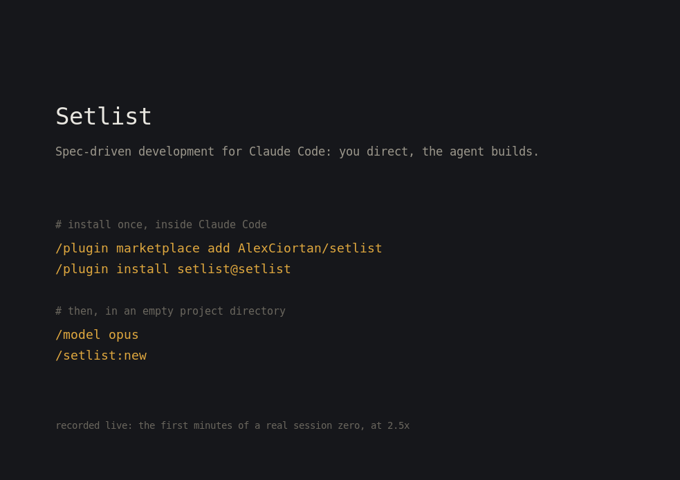
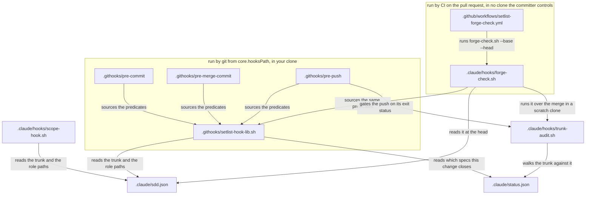

# Setlist

[](https://code.claude.com/docs/en/discover-plugins) [](https://github.com/AlexCiortan/setlist/blob/main/.claude-plugin/plugin.json) [](LICENSE) [](https://github.com/AlexCiortan/setlist/actions/workflows/test.yml)

**Setlist** is spec-driven development for Claude Code. You write the setlist, Claude Code plays it, and git hooks stamped into your repository refuse work that skipped the process. It is for one developer or a small team who would rather review than type, and who want every feature to arrive through a spec they approved, still true after the chat is gone, the context is compacted or the model is swapped. Spec Kit and BMAD give the agent a process to follow; Setlist gives git a process to enforce, in tracked hooks and a forge check, so it holds under any agent or none. It will not ship ten things in parallel for you to review later, and it is a discipline control for cooperating use, not a security boundary: Known limitations lists every place it stops, each with a date and a reason, and [How Setlist thinks](HOW-SETLIST-THINKS.md) is the ten-minute account a lead can forward to a team.

## Quickstart

Requires macOS, Linux, or Windows 11 with Git for Windows, and bash, git and `jq` on PATH (on Windows jq 1.7 or later; without `jq` every governed commit is refused). Requires Claude Code 2.1.193 or later (the marketplace rename migration and the `fallbackModel` chain both need it; the deny mechanic is verified on 2.1.200+; the re-grounding pointer reaches a resumed or continued session whole from 2.1.277). Install the plugin once from inside Claude Code, then open your project directory and run session zero on the escalation tier of the model ladder, which the edition's Part 2 table binds to `fable`, or to `best` where your organization has no Fable access. Day-to-day building runs under `/model opusplan`. `/setlist:validate` re-runs the `opusplan` probe in both phases and names a phase served by a model outside its tier, which a managed model allowlist changed after the stamp can cause. No plugin? Copy [`setlist.md`](setlist.md) into your project and ask a session on the escalation tier to run its bootstrap, retrofit or upgrade protocol.

```
/plugin marketplace add AlexCiortan/setlist
/plugin install setlist@setlist
/model fable     # or: /model best
/setlist:new     # an existing repo: /setlist:retrofit; an older instance: /setlist:upgrade
```

To see what Setlist would do before adopting it, observe mode, `/setlist:retrofit --observe`, reads an existing repository's last 50 merges and prints every one the trunk audit would have refused, by commit and code, installing and writing nothing; on an instance, `/setlist:upgrade` prints the same reading as a verdict delta between the audit you have and the new one, both ways, before anything is replaced.



## What you get: the operating loop

`/setlist:new` interviews you, proposes the stack and the core data model for your approval, stamps the hooks and an `AGENTS.md` pointer beside `CLAUDE.md` for other harnesses, and writes your first specs; `/scaffold` makes the first commit. Your `CLAUDE.md`'s golden rules tell the model that types to finish the spec and nothing more, to claim a change done only after a real check ran, and to give options when options are asked for. From then on, under Claude Code's `opusplan` setting, the Planner decides in plan mode and the Builder types in execution mode; your part is approvals, answers to parked questions and QA Pass 2, and you never type code or Git. Each feature runs one loop (your generated `RUNBOOK.md` has your stack's commands):

1. **Plan.** Shift+Tab into plan mode. The Planner re-grounds from `STATUS.md`, asks the genuine forks and proposes the next spec. You approve; the Builder writes it.
2. **Branch.** `/setlist:checkpoint` opens `spec/NNNN-<slug>`.
3. **Build.** Small commits with the gates run; ambiguities are parked in `STATUS.md`, never improvised. When the Builder loops on a bug, the `model-ladder` skill says when to escalate.
4. **QA Pass 1.** With gates green, the automated criterion check's report goes into the spec's Closing report.
5. **QA Pass 2.** You use the feature and spot-check at least one passed criterion.
6. **Close.** `/setlist:checkpoint` runs the close review: a second model, on the Opus tier in a fresh context, reads the branch's diff against the spec's criteria and reports every finding with its file and line; you fix what it finds and it reads again, two rounds at most, and the call past them is yours. Then it runs the close checklist and merges `--no-ff`, and git refuses a close whose review did not pass. `STATUS.md` names the next action.
7. **Next.** Shift+Tab, repeat.

## How it holds

The guarantee lives in git hooks that git runs from its own state after the shell is done, so it travels with the repository and holds under any agent or none. A merge that brings feature code to the trunk without closing a spec or recording a chore is refused in your clone, and the forge check asks the same questions on the pull request. You adopt it in levels, in this order:

| Level | Who needs it | What it refuses |
|-------|--------------|-----------------|
| **The git hooks** (`pre-commit`, `pre-merge-commit`, `pre-push`) | Everyone, in every clone | A commit, a merge or a push whose history skipped a spec |
| **The forge check** | A team | The pull request's merge, where the trunk requires the check beside a review |
| **The session layer** | Optional | Nothing: it warns the agent, and its one deny nudges |
| **Custody** | Whoever approves specs | A build whose spec approval is missing or drifted (a key, or the forge's review) |


```mermaid
flowchart TD
  scope[".claude/hooks/scope-hook.sh"]
  subgraph clone["run by git from core.hooksPath, in your clone"]
    precommit[".githooks/pre-commit"]
    premerge[".githooks/pre-merge-commit"]
    prepush[".githooks/pre-push"]
    lib[".githooks/setlist-hook-lib.sh"]
  end
  subgraph forge["run by CI on the pull request, in no clone the committer controls"]
    workflow[".github/workflows/setlist-forge-check.yml"]
    check[".claude/hooks/forge-check.sh"]
  end
  audit[".claude/hooks/trunk-audit.sh"]
  sdd[".claude/sdd.json"]
  record[".claude/status.json"]

  scope -->|"reads the trunk and the role paths"| sdd
  lib -->|"reads the trunk and the role paths"| sdd
  check -->|"reads it at the head"| sdd
  precommit -->|"sources the predicates"| lib
  premerge -->|"sources the predicates"| lib
  prepush -->|"sources the predicates"| lib
  check -->|"sources the same predicates"| lib
  lib -->|"reads which specs this change closes"| record
  prepush -->|"gates the push on its exit status"| audit
  workflow -->|"runs forge-check.sh --base --head"| check
  check -->|"runs it over the merge in a scratch clone"| audit
  audit -->|"walks the trunk against it"| record
```

**What the arrows assert.** Every refusal between unreviewed work and a shared trunk comes from `.githooks/pre-commit`, `.githooks/pre-merge-commit`, `.githooks/pre-push` through `.claude/hooks/trunk-audit.sh`, or `.claude/hooks/forge-check.sh`, and all four source one set of predicates in `.githooks/setlist-hook-lib.sh`; the scope hook's arrow is a read that ends in advice, never in a refusal. The trunk audit runs at every push and on every pull request and reads history rather than commands, so it sees work that arrived through a renamed branch, a cherry-pick or the forge's merge button. It walks from the trunk audit's baseline, `audit.baseline` in `.claude/sdd.json`, which `/setlist:upgrade` records where an instance's history predates its hooks. Refused merges complete the way the message says: the record added while completing a refused two-parent merge is read on the merge commit at push, as at commit. The armed check reports at session start when `core.hooksPath` or `merge.ff` is off, and the stamp refuses a bad answer by name. `pre-commit` and `pre-merge-commit` exit in silence on a checked-out branch without `.claude/sdd.json`, `pre-push` reads the pushed commits' own, and a branch without `.githooks/` runs no hook at all. Another hook manager (husky, lefthook, pre-commit) is chained rather than displaced, its hook running beside Setlist's own verdict, and an octopus onto the trunk is refused by name. A committer who crafts merges to evade the audit can, and those routes are the Known limitations. **Does it actually work?** Every release passes a dogfood gate, in which a fresh agent given only this repository takes a small application from an empty directory to a merged, twice-QA-passed feature. The suite behind the CI badge above drives every hook through fixture repositories on Linux and macOS at every push, and its platform smoke on Windows.

## Commands and skills

| Command | What it does | Invoked by |
|---------|--------------|------------|
| `/setlist:new` | Bootstraps an empty directory: interview, decisions for your approval, the two-phase stamp. | You only |
| `/setlist:retrofit` | Inventories an existing codebase read-only, then fits the framework around what exists. | You only |
| `/setlist:upgrade` | Migrates an instance to the bundled edition on one docs-only chore branch, gates unchanged. | You only |
| `/setlist:gate` | Runs a roadmap stage-gate transition against the stage's exit criteria. | You only |
| `/setlist:checkpoint` | Spec-scoped Git: the branch, commits with secret and style checks, the close checklist, the `--no-ff` merge. | You, or the model when about to commit |
| `/setlist:validate` | Health-checks the instance and reports findings, fixing nothing without approval. | You, or the model at a transition gate |
| `/setlist:journal` | Writes the numbered journal entry for a substantive session. | You, or the model after a substantive session |

`/scaffold` is not a plugin command: it is the project-local skill `/setlist:new` generates, which wires the test harness, makes the first commit and arms the git hooks by setting `core.hooksPath` and `merge.ff`. Five reference skills load by themselves when they apply:

| Skill | Loads when | Carries |
|-------|------------|---------|
| `model-ladder` | A session weighs escalating | The escalation rules between model tiers |
| `planner-discipline` | Planning starts | The operating loop, the read budget, park-do-not-improvise |
| `spec-authoring` | A spec is being written | The spec template and the Closing report contract |
| `design-surface` | UI work routes through a design intake | Locked redlines as spec contracts, design QA on the branch |
| `diagrams` | A diagram is drawn or synced | The routing test, the drawing rules, five type references |

## Teams and diagrams

Everything above works for one developer with one clone; since 2.6.0 the same discipline holds across a team, and since 2.7.0 a diagram is a set of claims the close checks. Each item links the boundary that says where it stops. **The forge check** runs as the status check `setlist forge check` on every pull request and asks the merge the button would make what the git hooks ask; require it in a ruleset on the trunk beside one approving review and code-owner review (the forge's "Require review from Code Owners" setting, which the check reads and requires under `forge` custody), and it names every pull-request edit to the enforcement paths. [Boundary](LIMITATIONS.md#forge-check-required). **`forge` custody** makes a spec's approval the ACTIVE flip landing on the protected trunk through the required review, with no signing key. [Boundary](LIMITATIONS.md#forge-check-required). **The CODEOWNERS bridge** makes `.githooks/`, `.claude/`, `specs/attest/` and `.github/` reviewed changes and judges every spec's `Owns:` lines against the stamped file. [Boundary](LIMITATIONS.md#codeowners-bridge). **Parallel specs** run on two branches with disjoint `Owns:` sets and close in turn; since 2.11.0, when the sets overlap, the audit refuses the second close by name until its branch carries the first close's change. [Boundary](LIMITATIONS.md#declarations-claim). **The merge-edit report** (2.11.0, git 2.38 and later) names every file a two-parent merge changed outside the files that conflicted, for a reviewer to read; it reports and never refuses. [Boundary](LIMITATIONS.md#crafted-merges). **Three gate tiers**, `gates.commit`, `gates.close` and `gates.push` in `.claude/sdd.json`, name what runs at each layer. [Boundary](LIMITATIONS.md#fast-forward). **The lite spec tier** keeps the parts the gates read and refuses a lite spec past five files as `SLH-LITE-OVERSIZED`. [Boundary](LIMITATIONS.md#declarations-claim). **The bypass deny**, the session layer's one refusal, stops a command that disarms the git hooks for its own run, and since 2.10.0 reads a heredoc behind a prefix or without the space, judges one piped into a shell or opened inside a substitution, and stops refusing a line continued with a backslash. [Boundary](LIMITATIONS.md#hard-deny-expansion). **The scope hook's** advice about a write on the trunk reaches the agent, and the scope hook's path matching now resolves a relative path, a symlinked leaf (up to sixteen links, and it says when it stops) and a role spelled in another case. [Boundary](LIMITATIONS.md#advisory-persuades). **The Stop hook** refuses once to end a turn that leaves a spec change unstaged, and the Stop hook's reasons lead with the fix. [Boundary](LIMITATIONS.md#stop-hook). **Secret files** are named in the stamped deny list (`.env`, `.env.local`, `.env.production` and their kin) rather than matched by a pattern that hid `.env.example`.

**Three diagram altitudes** (context, containers, components), each file under `docs/diagrams/` opening with a four-line header, and a close whose diagram field must name the files the closing commit touched. [Boundary](LIMITATIONS.md#diagram-checks). **Node evidence**: a drawn path that does not exist at the close is refused for the closing spec's own nodes, and inline edge labels are read as labels, not nodes. [Boundary](LIMITATIONS.md#diagram-checks). **A generated view as a lockfile**, opt-in through `diagram_command`, must equal that command's output at every close. [Boundary](LIMITATIONS.md#diagram-checks). **Render validation** at the forge parses every Mermaid block under a pinned version and refuses one that does not parse. [Boundary](LIMITATIONS.md#diagram-checks). **The `diagrams` skill and the Design sketch** let a spec draw the intended change, which `/setlist:checkpoint` folds into the living diagrams at the close.

## Why one spec at a time

One spec is active at a time and no two agents write coupled code at once, because for a person directing rather than typing the bottleneck is not how fast code appears but how much of it can be reviewed before the next thing is built on it: ten features in parallel is not ten times the progress if you can genuinely review two. Read-only work fans out freely (inventory sweeps, probes, verification runs), and across a team two people can each run a spec on their own branch, because disjoint `Owns:` declarations cannot collide at the audit, overlapping ones are refused at the second close until its branch has taken the first, and the forge check judges every merge; what Setlist does not have, by design, is a coordination plane inside one checkout.

## Known limitations

**The guarantee lives in the git hooks, not in your Claude Code session:** the session hooks carry no part of it, and the push-time trunk audit is what stands between unreviewed work and a shared trunk. Read the list as a threat model: each bullet is a fact about git, the forge or the harness that a hook cannot refuse, and each release's adversarial review tests those routes on the shipped bytes. **Design boundaries** are decisions with a date and a reason, **open limitations** are defects with a status, and **upstream conditions** are things this project does not control. Each group opens to a title and one sentence per bullet, and [LIMITATIONS.md](LIMITATIONS.md) has the full text, what to do, and the history; **the counts live on the group headings below and nowhere else.**

### Design boundaries (24)

<details><summary>Show the design boundaries</summary>

- **Git hooks are per-clone, and the tracked directory narrows that without closing it.** A fresh clone has the hooks but not the config that points at them, so it is unprotected until `refresh-instance.sh --apply` runs; the forge check is the layer that does not live in a clone. [Full text.](LIMITATIONS.md#per-clone-hooks)
- **`--no-verify` and `SETLIST_SKIP_HOOKS=1` skip the git hooks, the push-time audit included.** A deliberate flag with an obvious name, or Setlist's own escape variable, which every git hook reads first, skips every git hook, the push-time audit and content scan included; `SETLIST_SKIP_TRUNK_AUDIT=1` is the narrow escape, no refusal names either, and the forge check has no such flag. [Full text.](LIMITATIONS.md#no-verify)
- **git allows one `core.hooksPath`, so Setlist runs another hook manager's hooks through its own rather than beside them.** The stamp and the refresh chain husky, lefthook or pre-commit rather than displace it: each Setlist git hook runs that manager's hook of the same name beside its own verdict (before its checks where the index becomes the commit), and both refusals surface; a manager that re-points `core.hooksPath` on install switches Setlist off again, which the next session start reports. [Full text.](LIMITATIONS.md#hookspath-conflict)
- **`git merge --ff-only`, `--ff` and `--squash`: a fast-forward fires no merge hook, and squash needs one flag under the stamped setting.** A fast-forward creates no merge commit, so no merge hook runs, and the stamped `merge.ff=false` makes a plain `--squash` fail with a message that names neither Setlist nor the setting; the push-time audit still reads a one-commit close correctly, a squash included, and refuses a multi-commit fast-forward on its intermediate commits. [Full text.](LIMITATIONS.md#fast-forward)
- **The trunk audit's frame is declared in `.claude/sdd.json`, the trunk by name and the baseline by commit, and a declaration is a claim under the same custody as the rest of `.claude/`.** Merge onto a branch with another name than the recorded trunk and the whole layer stays silent; the audit walks history from `audit.baseline`, which the upgrade records where an instance's history predates its hooks, and a key moved forward walks less, so review it as you review the hooks. [Full text.](LIMITATIONS.md#trunk-name)
- **A first push to a brand-new EMPTY remote audits every pushed branch as a trunk candidate.** With no default branch yet, `pre-push` cannot know which ref becomes the trunk and audits them all, refusing a spec branch pushed first; this fails closed. [Full text.](LIMITATIONS.md#empty-remote)
- **The push-time hooks read only the branch and tag namespaces, so a push to a review-ref namespace is ungoverned by them.** A push to Gerrit's `refs/for/<branch>` or any other namespace skips both the content scan and the trunk audit; since 2.7.0 the hook reports the skip by name, and the ways through are to push the trunk directly or to require the forge check. [Full text.](LIMITATIONS.md#review-ref-namespace)
- **The staged-content scans read every staged line unless you scope them.** The em-dash and secret scans read every added line of the index, vendored code and fixtures included, unless `scan_exclusions` in `.claude/sdd.json` names the paths; every skip is printed with the glob that matched it. [Full text.](LIMITATIONS.md#scan-scoping)
- **Secret and style scanning is best-effort early warning, not a guarantee.** The scan reads a rendering the repository controls with a first-cut pattern set, so it catches accidents on the ordinary path and nothing more; since 2.11.0 a `.gitattributes` `-diff` or `binary` entry no longer hides a text file from it, except in a merge commit's own change at push. [Full text.](LIMITATIONS.md#scan-best-effort)
- **A checkout decides which hooks exist: a branch that does not carry `.githooks/` runs no git hook, and commit and merge time read the checked-out `.claude/sdd.json`.** A branch that never carried Setlist has no `.githooks/`, so checking it out leaves git no hook to run and a push refused from the trunk succeeds from it; `pre-push` reads a pushed commit's own `.claude/sdd.json` when the checkout has none, and the forge check refuses a pull request whose head carries none. [Full text.](LIMITATIONS.md#checkout-switch)
- **The set of tested platforms is a list, not a proof.** The suite runs on Linux under two awks, on macOS under bash 3.2 with the BWK awk, and since 2.11.0 on Windows 11 under Git Bash, where a hook call costs about three times a Mac's and NTFS cannot hold some of the file names the suite exercises; the list is extended, never restated as a proof. [Full text.](LIMITATIONS.md#platform-list)
- **The close review is a second model on your own account: it shares the builder's blind spots on taste, not on bytes, so its block is a verdict per criterion and never a grade.** It reads bytes against criteria in a fresh context, not with a different judgment; QA Pass 2 stays yours, and so does the decision at its two-round cap, recorded as `ACCEPTED-BY-HUMAN` beside the reviewer's verdict. [Full text.](LIMITATIONS.md#close-review)
- **A diagram check compares a claim to a diff and a lockfile to a command's output; it does not judge whether a drawing is true of the code.** The field checks establish that the files the closer named are the files the commit touched, the node check that every drawn path exists, and the lockfile that the generated view equals the command's output; only a path-shaped name (a slash, no whitespace) is checked and the rest is printed as unverified, three Mermaid shapes unread by decision, and the render check parses only where a renderer runs, failing the stamped workflow's job rather than passing without one. [Full text.](LIMITATIONS.md#diagram-checks)
- **The session layer's one hard deny is defeated by ordinary variable expansion, so read it as a nudge and never as a boundary.** `git commit -m ${MSG} --no-verify` is allowed in silence, because an unquoted expansion before the flag defeats the lexer behind `CM-BYPASS-SPELLED`; crafted spellings defeat it too (a wrapper before the escape variable or a redirection before the flag among them), it is silent on a broken jq or awk, the git hooks are unaffected, and the parser freeze is why none is repaired. [Full text.](LIMITATIONS.md#hard-deny-expansion)
- **The session layer's one command reader is a frozen text parser, and a short list of spellings reads a command wrongly.** Since 2.8.0 the bypass deny's lexer is the only session code that reads command text; it is frozen since 2026-08-04 and pinned by digest, changed three times by decision to stop false denials, to read a heredoc piped into an interpreter, to read a wrapper's options by its own grammar and to stop counting a reader that can run a shell as data, a short list of spellings still misleads it, and for all but one item the git hooks judge the same operation correctly afterwards. [Full text.](LIMITATIONS.md#parser-spellings)
- **The session layer's one deny stops a command that disarms the hooks for its own run; a persistent change to `core.hooksPath` or `merge.ff`, and a fresh clone, are reported at the next session start and refused by nothing.** A setting changed with `git config` or never armed in a fresh clone leaves the git hooks off for every later command, and the next session opens with one `[SR-HOOKS-NOT-ARMED]` line naming the setting and `/setlist:upgrade`. [Full text.](LIMITATIONS.md#armed-check)
- **The forge check reads what the forge exposes: it governs the merge button only where the trunk requires it, reads the trunk's protection as it stands now, and runs the pull request's own copy of itself.** The stamped check is a report until the trunk lists `setlist forge check` as required beside a review and review from Code Owners; it cannot require itself, a rebase-merge trunk defeats it before the fact, a trunk protected after an unreviewed flip landed verifies that flip, and a pull request that edits the workflow or the hooks is judged by its own edit, which is why the check refuses a `forge`-custody trunk without "Require review from Code Owners" and names every edit to the enforcement paths. [Full text.](LIMITATIONS.md#forge-check-required)
- **The CODEOWNERS bridge reads a subset of the file's grammar, and a pattern is a claim about paths.** `Owns:` declarations are judged against the core CODEOWNERS grammar; sections, negations and character classes are refused by name (GitHub evaluates no character class either), and only email owners resolve locally. [Full text.](LIMITATIONS.md#codeowners-bridge)
- **A declaration is a claim, not a verified fact: the single-parent close arm is as strong as your `Owns:` lines, and the integrity chain as strong as where your signing key lives.** A close is audited file by file against its own `Owns:` lines, which travel in the commit they justify, so the hooks verify coverage, not truth, and a spec that declares nothing closes under the older whole-commit exemption; a signature proves a key was used, not that a person decided, and `forge` custody has no key and rests on the forge's required review instead. [Full text.](LIMITATIONS.md#declarations-claim)
- **The hashed range ends at the FIRST line reading `## Closing report`, fences included, and the ownership reader agrees with that cut.** A quoted copy of the template above your `Owns:` lines ends the signed range early and the declaration below it is refused as out of range; the refusal names the one-edit fix. [Full text.](LIMITATIONS.md#hashed-range-cut)
- **A session killed from outside fires no Stop, and the Stop hook is a nudge, never a lock.** The Stop hook refuses to end a turn with an unstaged spec or `specs/STATUS.md` change, once, in a project with its own repository; a session killed from outside fires nothing, and the git hooks are what refuse the work. [Full text.](LIMITATIONS.md#stop-hook)
- **Deliberate evasion: a committer who crafts history to pass the trunk audit can, and the list of known routes is maintained rather than complete.** A chained merge and its octopus spelling into a spec branch hide unspecced work behind a compliant close (an octopus onto the trunk is refused since 2.11.0); five sideways commands (`git cherry-pick`, a detached-HEAD merge, `git rebase`, `git reset --hard`, the pathspec checkout) are refused at push unless composed with a compliant close that declares no ownership; and a merge that edits a file outside its conflicts is reported on git 2.38 and later, never refused, while an edit inside them reads as resolution. [Full text.](LIMITATIONS.md#crafted-merges)
- **The Bash escape hatch.** The scope hook watches the file-writing tools, so a write through Bash (`cat >`, `sed -i`) draws nothing, and a git command run through another interpreter is not one the bypass deny can read; the trunk audit is the designed catch. [Full text.](LIMITATIONS.md#bash-escape)
- **The scope hook's warning reaches the agent, and the agent may proceed anyway: advisories persuade, hooks refuse.** Since 2.9.0 the scope hook's reason rides the field Claude Code delivers to the agent, and an agent may still judge the write harmless and proceed; the git hooks' refusals at commit, merge and push are what hold. [Full text.](LIMITATIONS.md#advisory-persuades)

</details>

### Open limitations (0)

None stands at 2.11.0: the two that stood at 2.9.0 were fixed in this release. [Full text.](LIMITATIONS.md#open-limitations-0)

### Upstream conditions (1)

<details><summary>Show the upstream conditions</summary>

- **A timed-out hook is a skipped gate.** Claude Code cancels a hook past its timeout and lets the tool call proceed; the stamped timeouts are 300 seconds since 2.6.0, and a gate command that fails only under the hook's non-interactive PATH is a false deny. [Full text.](LIMITATIONS.md#hook-timeout)

</details>

## Repository contents

| File | What it is |
|------|------------|
| [`setlist.md`](setlist.md) | The framework edition, the single source of truth (the version is stated inside the file). |
| `.claude-plugin/`, `skills/`, `templates/`, `scripts/`, `test/`, `.github/` | The plugin, a binding of the edition, with the hook suite and the workflow that runs it on every push. |
| [`HOW-SETLIST-THINKS.md`](HOW-SETLIST-THINKS.md), [`LIMITATIONS.md`](LIMITATIONS.md) | The ten-minute account a lead forwards to a team, and every boundary in full. |

## Versions

The current edition of the framework document is **[setlist.md](setlist.md)** (edition v1.19, the boundary edition; the version lives inside the file); you do not need to read it to start, and its Parts 1 and 10 are the short way in. **Three numbers, and what each counts.** The edition version counts the protocol (`setlist.md`, v1.19 at this release; it moves when the document changes what a gate asks or what a close writes). The plugin version counts the binding (`.claude-plugin/plugin.json`, 2.11.0; it moves on every release of the tooling, edition turn or not). The plugin counter restarted at 1.0.0 when the plugin was renamed to `setlist`, so the releases numbered 1.6.0 through 1.8.0 that the edition's changelog names belong to the pre-rename plugin and a Setlist version below them is not a downgrade.

## Contributing

Field reports are the framework's fuel: [open an issue](https://github.com/AlexCiortan/setlist/issues) with what held and what fought you, and use the form "A refusal I did not expect" for a refusal. [CONTRIBUTING.md](CONTRIBUTING.md) says how changes land, and [SECURITY.md](SECURITY.md) how to report a security problem. **For a reviewer:** at hook time the plugin fetches nothing and runs only the commands your `.claude/sdd.json` declares, and the stamped workflow installs `jq` and a pinned Mermaid parser. The forge check sends the workflow's own token only to the forge that issued it, and the suite's tokens are fixtures. The demo GIF is the one binary in the package and nothing runs it; the scripts name image files only to leave them unread.

## About the author

Built by [Mihai Alexandru (Alex) Ciortan](https://www.linkedin.com/in/alexciortan), Principal Architect with 15+ years of enterprise platform engineering at one of the world's largest game publishers and part-time CTO at DEIO. The framework is distilled from running real projects with Claude Code end to end, and this repository is maintained under the discipline it describes.

## License

© 2026 Alex Ciortan. The code (`scripts/`, `templates/`, `test/`, `skills/` and `.github/`) is released under the [Apache License, Version 2.0](LICENSE), and each stamped hook and script says so in an SPDX line at its top. The framework document, [setlist.md](setlist.md), and the prose beside it are released under the [Creative Commons Attribution 4.0 International License](LICENSE) (CC BY 4.0): use, adapt, and share it, including commercially, as long as you give appropriate credit. Suggested attribution: "Setlist, a spec-driven development framework by Alex Ciortan, licensed under CC BY 4.0." Both texts are in [LICENSE](LICENSE).
