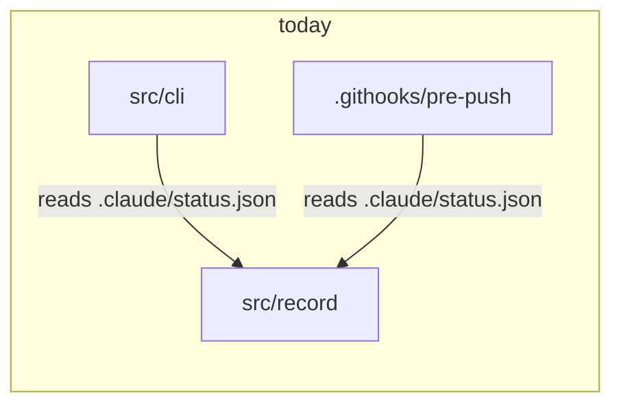
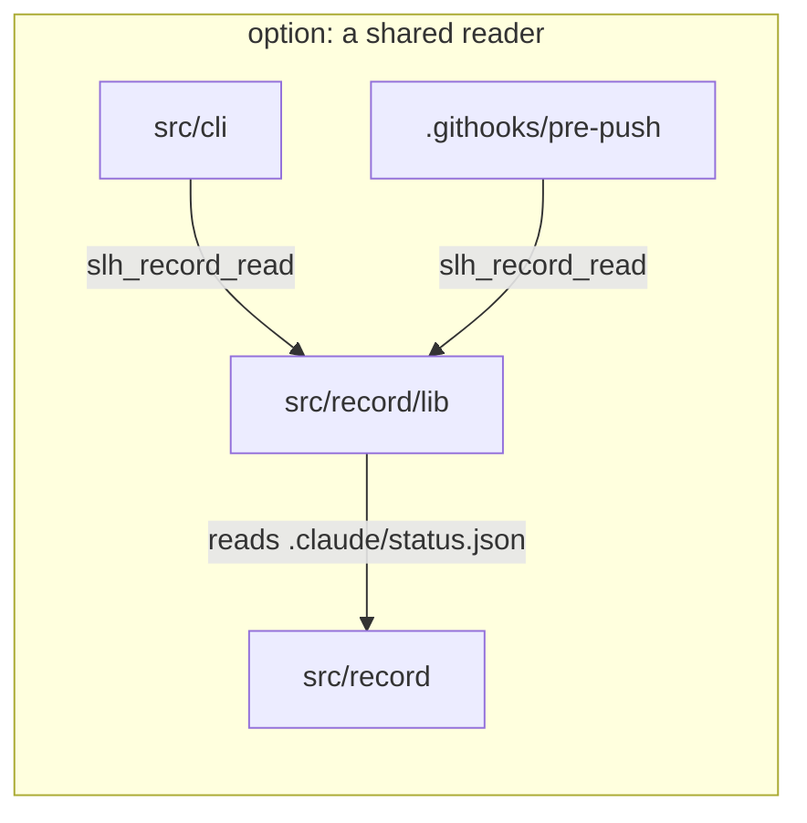

# comparison: what changes between two options

Invent no topology, keep exact names, label every arrow, one figure one claim, no
line ranges as evidence, no rendered image as source.

This is the type for a decision: a spec's Design sketch weighing two shapes, or
an ADR recording which one was taken and why. It has one rule that the other
types do not, and the rule is the whole type: **draw the DIFFERENCE, never two
labeled boxes.** A picture of "Option A" beside "Option B" tells a reader
nothing they could not get from the headings; a picture of what A adds and what B
removes is the argument.

## The shape

Two small blocks, same layout, same node names, so the eye lands on what moved:

One node added, two arrows re-pointed, nothing else moved. That is a difference a
reader can price. If your two blocks differ in layout, direction or naming, the
reader is comparing your drawing habits rather than your options.

## The rules that make it a comparison

- **Same node names on both sides.** A node that exists in both keeps its name
  and its drawn path. A renamed node reads as a new node and hides the change.
- **Same direction and same order.** `LR` on both, participants in the same
  sequence. The difference should be the only thing that differs.
- **Label what each arrow carries, on both sides**, so a re-pointed arrow shows
  whether the protocol changed too.
- **Mark what is new and what goes.** A one-word label (`new`, `removed`) or a
  comment on the line is enough; a legend is a sign the figure is doing too much.
- **Two options, not four.** Three shapes in one comparison is a survey, and a
  survey is prose with a table. If the decision really has three live options,
  compare the two that are close and say in a sentence why the third is out.

## Where it lives

In the spec's `## Design sketch` while the decision is open: it is what the owner
approves. In `DECISIONS.md` once it is taken, inside the ADR's own sketch block,
where it does the job the ADR log exists for, which is making a decision harder
to re-litigate. A decision with a picture of its difference survives the
conversation that reopens it six months later.

It does NOT belong in the living diagrams. `docs/diagrams/` holds the system as
it is on the trunk; a comparison holds a choice, including one that was not
taken. Absorbing a comparison into a living diagram at close means keeping the
side that shipped and deleting the other, which is a redraw, not a move.

## What goes wrong

- Two boxes labeled with the option names and an arrow between them, which is the
  failure this type is named after.
- A comparison that omits the current state, so the reader cannot see the cost of
  moving at all. Where a change has a "today", today is one of the two sides.
- Drawing the option you prefer in more detail than the other. Same altitude on
  both sides, or the figure is an argument dressed as a diagram.
