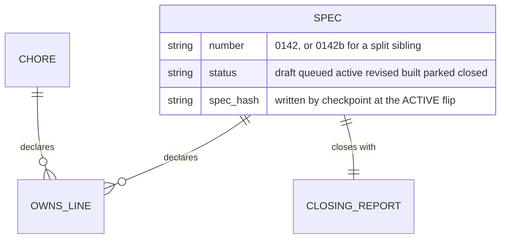
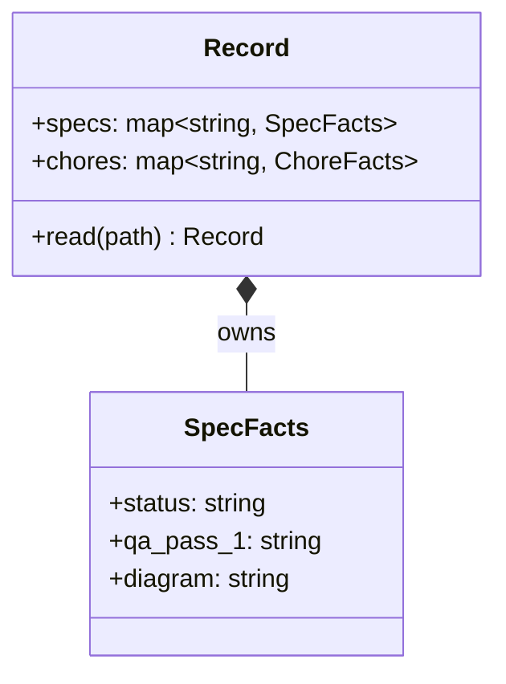

# erDiagram and classDiagram: the shape of the data

Invent no topology, keep exact names, label every arrow, one figure one claim, no
line ranges as evidence, no rendered image as source.

This is the type for the central data structure, and its home is the core-model
section of `steering/structure.md`, beside the prose that defines it. The prose
states the invariants; the picture shows the shape. Neither replaces the other,
and if the prose is thin the answer is better prose, not a bigger diagram.

## Which of the two

`erDiagram` when the thing is persisted and relationships carry cardinality: a
schema, a store, a set of tables or collections. `classDiagram` when the thing is
in memory and what matters is composition and the operations on it: the core
types, their fields, the methods that transform them.

## erDiagram

- **Entity names are the real names**, in the spelling the store uses. If the
  table is `specs`, the entity is `SPEC` or `specs`, chosen once and kept.
- **Cardinality is a claim, so get it right.** `||--o{` says one to zero-or-many
  and `||--||` says exactly one to exactly one. A relationship drawn one-to-many
  where the schema allows many-to-many is the same class of error as an arrow for
  a call that is not made.
- **Attribute comments carry the constraint** the type cannot: the admitted
  values, the unit, the fact that a field is written by one component only. That
  is where the invariants a reader needs actually live.

## classDiagram

- **Fields and methods are the real signatures**, as the code spells them,
  including the types. A method drawn without its return type is half a claim.
- **Composition (`*--`) versus association (`-->`) is a real distinction**: the
  first says the lifetime is owned, the second says it is not. Drawing both as a
  plain line loses the only thing the type adds over a list.
- **Draw what the decision turns on.** A class with thirty fields gets the four
  that matter and a note saying so; a diagram that transcribes a struct is a
  worse version of the struct.

## The one rule people skip

The core model is the highest-leverage document, so this figure is the one most
worth keeping true, and it is also the one that rots quietly: schema changes land
in migrations, and nothing in a migration reminds you the picture exists. The
close is what catches it, and only if you name the file in the diagram field.
When a spec changes the shape of the data, `steering/structure.md` is in the
field's file list; when a spec adds a column nobody draws, say `no impact` and
mean it.

## What goes wrong

- Cardinality copied from the domain rather than from the schema, so the picture
  describes what should be true instead of what is enforced.
- A class diagram of the whole package, which is a directory listing with boxes.
- Two figures' worth of claim in one: the persisted shape and the in-memory shape
  in a single block. They are different claims with different lifetimes; draw
  them separately and let each be checked on its own.
