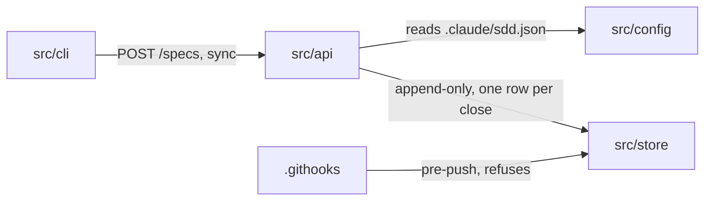
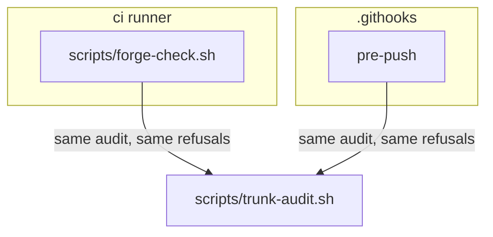
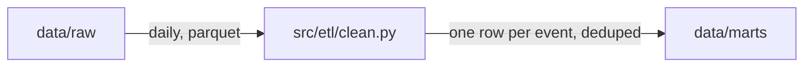

# flowchart: the pieces and which talk to which

Invent no topology, keep exact names, label every arrow, one figure one claim, no
line ranges as evidence, no rendered image as source.

This is the type for L2 containers and L3 components, and for the two questions
that look like their own types and are not: the WORKFLOW question (approval
chains, CI stages, runbook steps) and the DATA-FLOW question (pipelines,
lineage). Both are labeled flowcharts; what makes them honest is the label and
the `Encodes:` line, not a different renderer.

## The shape

Read the four rules off that block:

- **A node's drawn name is the path it draws**, inside the brackets, quoted. The
  close resolves that text against the tree, so `api["src/api"]` is checkable and
  `api["The API"]` is not: the second one is reported as not path-shaped rather
  than verified, which tells you the diagram is making a claim nobody can check.
- **A name is path-shaped when it contains a slash and no whitespace.** A module
  identifier with a dot and no slash (`app.services.auth`) is not path-shaped;
  either draw the directory it lives in, or accept the printed skip knowingly.
- **Every arrow carries what it carries**: the protocol, the command, the API
  path, or the event, exactly as the code spells it. `-->|"POST /specs, sync"|`
  is a claim you can grep for. An unlabeled arrow is allowed only when both
  endpoints already say the protocol, the action, the direction, whether the call
  is synchronous, and any boundary crossed.
- **A node a spec introduces carries its spec** on the node's own line:
  `worker["src/worker"] %% spec 0142`. That is how a stale node is attributed
  later, and it is what makes the difference between a refusal (your own spec's
  node is wrong now) and a report (an older spec's node has rotted).

## Direction and grouping

`LR` for a request path or a pipeline, `TD` for a hierarchy or a stage sequence.
Subgraphs draw a boundary the code actually draws (a process, a deployable, a
trust boundary), never a category you invented to tidy the picture:

If a subgraph has one member, it is a label pretending to be a boundary. Drop it.

**A subgraph's id and its title are both drawn names**, resolved exactly as a
node's label is. So a boundary that IS a directory should spell it as the id
(`subgraph templates/git-hooks["the hook layer"]`), and it is then checked; a
boundary that is a process or a trust boundary has no path to spell, and both its
id and its title come back printed as not path-shaped, which is the report doing
its job rather than a complaint. The one thing neither may be is a stale path: a
path-shaped subgraph id your own spec drew and the tree does not have refuses the
close like any other drawn name.

## Altitude

L2 draws containers, the deployables and the stores, not the files inside them,
and it lives in the document a reader of this system actually opens: the bottom
of `steering/structure.md` for an ordinary application, the project's own README
for a library or a tool whose readers are not its maintainers. One L2 view
exists, in one place. L3 lives at `docs/diagrams/components/<role-path>.md`, one
file per role path, and draws inside one container. Twelve primary nodes is the
bound at both altitudes; over twelve, split into `components/<parent>/<child>.md`
and let the parent node stand for the child diagram. Validate reports the count
and refuses nothing, so a thirteenth node is a decision you make, not one the
tooling makes for you. **Where there is no child to split into**, which is every
diagram drawn inline in a README or an ADR, that escape is unavailable and the
bound is hard: cut a node, and say in the prose that it is not drawn.

## The data-flow variant

A pipeline is a flowchart whose arrows carry the data and whose header's
`Encodes:` line states the rule the arrows assert, so that a reader can tell a
lineage claim from a drawing:

`Encodes: nothing writes to data/marts except src/etl.` That sentence is the
claim; the arrows are how you see it. Without it the picture is decoration.

## What goes wrong

- Drawing the org chart instead of the mechanism. If a box is a team, it is not a
  container.
- A node named for what the component MEANS rather than where it lives, which
  reads well and cannot be checked.
- Arrows that mean "depends on" in three different senses in one figure with
  nothing to tell them apart. The rule is **one sense per ARROW, named in the
  label**, not one sense per figure: the block at the top of this file mixes an
  invocation with a read, as any honest container view does, and it is legible
  because each arrow says which it is. An arrow whose sense the reader has to
  guess is the defect; a figure with two named senses is not.
