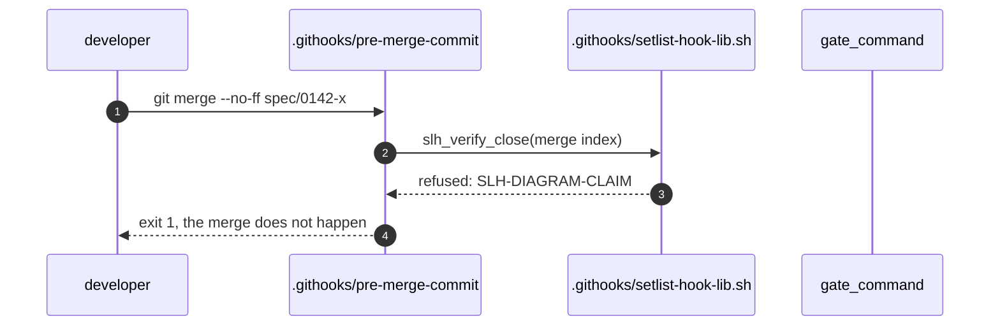
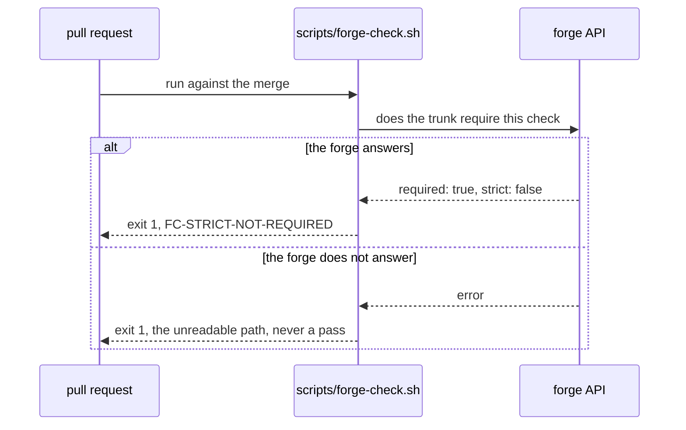

# sequenceDiagram: what happens, in order, when X

Invent no topology, keep exact names, label every arrow, one figure one claim, no
line ranges as evidence, no rendered image as source.

This is the type for a flow: one triggering event, the participants it touches in
order, and how it ends. It is born in a spec's Design sketch, where it shows the
INTENDED change; a flow worth keeping past the close is promoted to
`docs/diagrams/flows/<NNNN>-<slug>.md` with `Synced by:` naming the spec.

## The shape

- **Participants are named for what they are in the tree.** A path where there is
  a path (`.githooks/pre-merge-commit`), a command where there is a command
  (`gate_command`), a role where the actor is a person (`developer`). The node
  check does not read this type, so nothing verifies these names for you: that
  makes the discipline more important here, not less.
- **Every message is the real call.** `slh_verify_close(merge index)` is
  greppable; "validates the merge" is a paraphrase, and a paraphrase is how a
  diagram starts lying without anyone editing it.
- **Solid for a call, dashed for a return** (`->>` and `-->>`). If a call is
  asynchronous, say so on the arrow (`->>+`, or the word in the label); a reader
  who cannot tell sync from async cannot use the figure to reason about failure.
- **`autonumber`** when the order is the point, which for this type it usually
  is.

## Failure is part of the flow

A sequence that draws only the happy path is a claim that failure does not
happen. Draw the branch that matters, with `alt` and `else`, and stop:

Two branches is usually the whole story. Three is a sign the figure is carrying a
second claim and wants to be two figures.

## Where it lives, and what it is not

At creation the sketch sits in the spec, above Scope, and is deleted if a
sentence says it faster. At close, checkpoint asks which living diagrams absorb
it. **The sketch is not the sync**: the sketch shows the intended change and
stays in the closed spec as the record of intent; the living diagram shows the
system as it is. A reader compares the two later, which only works if you did not
overwrite one with the other.

Notes (`Note over a,b: ...`) carry a constraint the arrows cannot: a timeout, a
lock held, an idempotency key. Use them for facts, not for commentary.

## What goes wrong

- A participant that is an abstraction ("the system"), which makes every arrow
  unfalsifiable.
- Loops drawn with `loop` when the real code retries with a bound. Put the bound
  in the label: `loop up to 3 attempts, 2s backoff`.
- A flow promoted to `docs/diagrams/flows/` and never re-read, so `Synced by:`
  names a spec from a year ago. That is exactly what the stale-node report and
  the header exist to surface; a flow nobody syncs should be deleted rather than
  kept as scenery.
