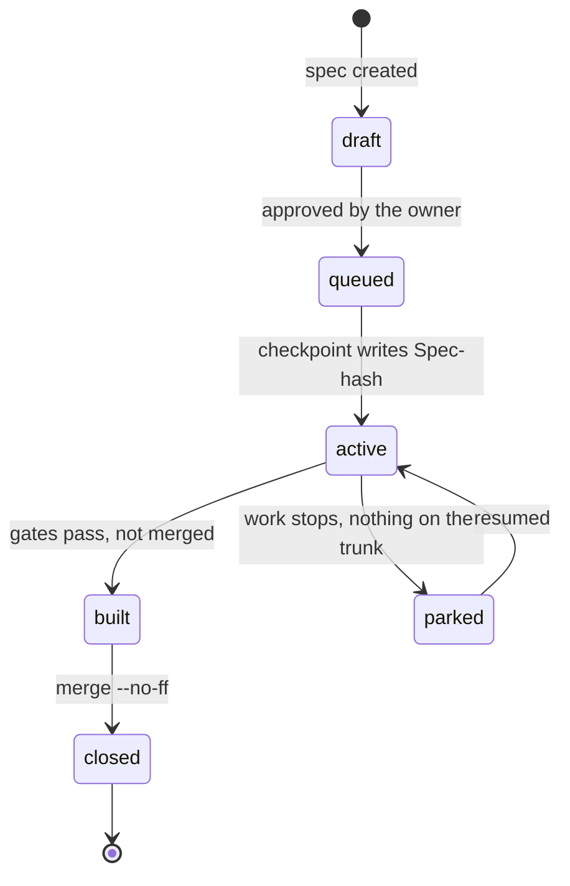
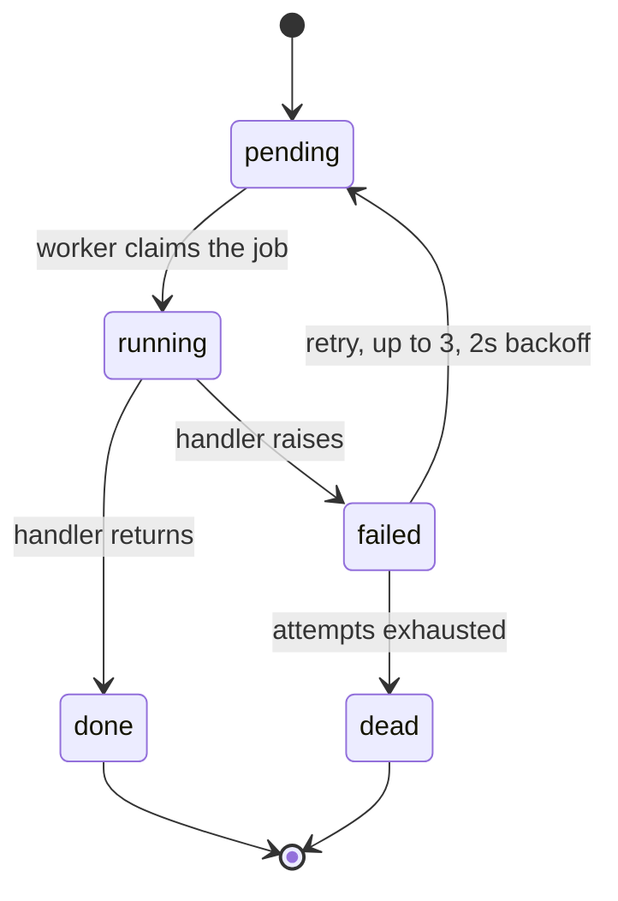
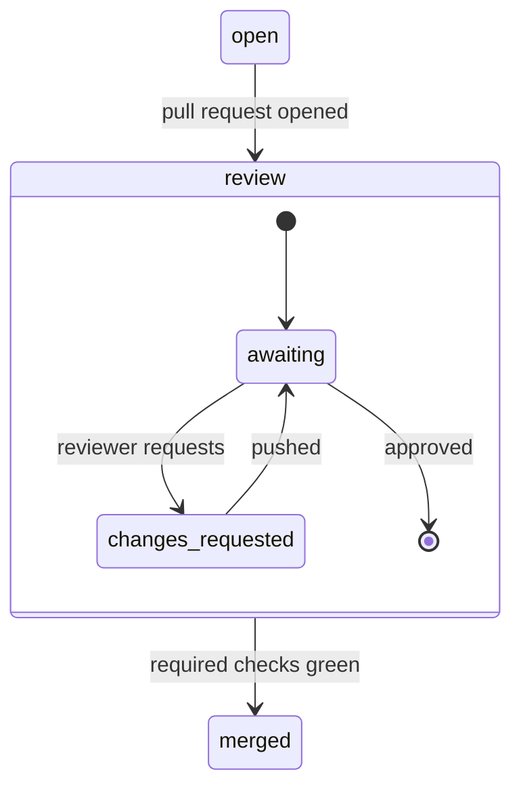

# stateDiagram-v2: what states can this thing be in

Invent no topology, keep exact names, label every arrow, one figure one claim, no
line ranges as evidence, no rendered image as source.

This is the type for a lifecycle: the states a record, a job or a branch can
hold, the events that move between them, the retries, and the terminal outcomes.
It lives beside the component it belongs to, which usually means the L3 file for
that role path.

## The shape

- **A state is spelled exactly as the code spells it.** If the record admits
  `"closed"`, the state is `closed`, not `Complete`. This type has no automatic
  check behind it, so the only thing keeping it true is that you used the real
  token and a reader can grep for it.
- **Every transition carries its event**, and the event is the thing that
  actually causes it: a command, a hook firing, a field being written. "moves to
  active" is not an event; "checkpoint writes Spec-hash" is.
- **Terminal states are drawn as terminal.** `--> [*]` says the lifecycle ends
  there. A state with no outgoing arrow that is not terminal is a bug in the
  diagram or in the code, and finding out which is the point of drawing it.

## Retries and bounds

A retry is the transition most often drawn as a lie, because the picture says
"retries" and the code says "three times with backoff, then a dead letter". Put
the bound on the arrow:

Two terminal states, both drawn. A lifecycle with one terminal state and a real
failure path is the commonest omission in this type.

## Composite states

Nest only when the inner states are real and the outer name is real too:

If the outer name is a phase you invented to group three states, do not nest;
grouping for tidiness is how a diagram acquires a boundary the code does not
draw.

## Where the twelve-node rule bites

States count as nodes. A lifecycle over twelve states is almost always two
lifecycles that share a name (an entity's own states, and its review or delivery
states), and splitting them is a better figure as well as a smaller one. Validate
reports the count; the split is your call.

## What goes wrong

- Drawing the states a designer intended rather than the ones the enum holds.
  Read the enum.
- Transitions with no event, which turn the figure into a picture of hope.
- A state that exists only in the diagram because it "should" be there. That is
  invented topology, and it is the same defect as a box with no component.
